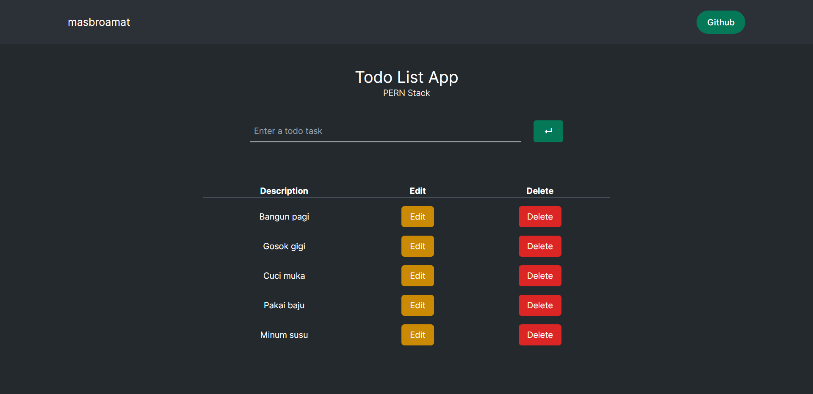

# To-Do List App

A simple **To-Do List** application built using the **PERN** stack (PostgreSQL, Express, React, Node.js).

## Features
- Add new tasks to your list.
- Edit existing tasks.
- Mark tasks as complete or delete them.
- Store tasks in a PostgreSQL database.
  
## Tech Stack
- **Frontend**: React.js
- **Backend**: Node.js with Express
- **Database**: PostgreSQL
- **Styling**: Tailwind CSS
